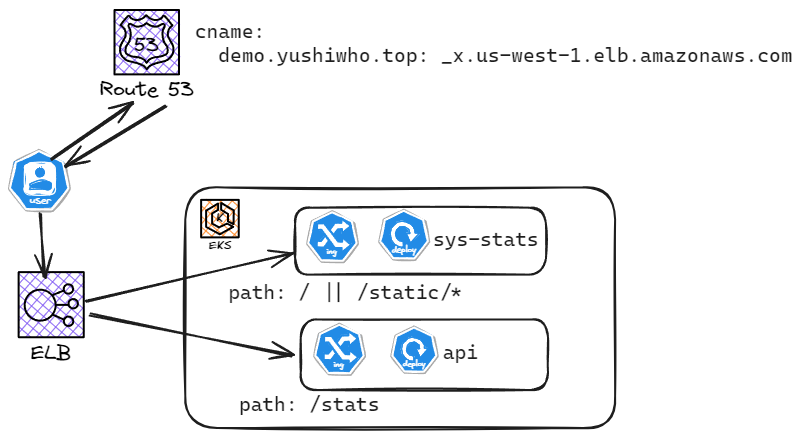

# Demo Project Leverages EKS on AWS for Scalable and Secure Service Deployment

Key Components:

EKS Cluster: A new Amazon Elastic Kubernetes Service (EKS) cluster provides the foundation for hosting containerized applications.

Helm: Helm streamlines the deployment and management of Kubernetes applications.

Deployed Services:
- [api](https://artifacthub.io/packages/helm/v2fly/demo-backend): Exposes core application functionalities through APIs.
- [sys-stats](https://artifacthub.io/packages/helm/v2fly/demo-frontend): Monitors system health and performance metrics.

ELB: An Elastic Load Balancer (ELB) distributes traffic across services, ensuring scalability and availability.

HTTPS: Secure communication is enforced using HTTPS, protecting data in transit.



# Init terraform backend
Change tf backend s3 bucket, aws profile name and aws region in sample.tfbackend
```
terraform init -backend-config=sample.tfbackend
```
# Update variable
Create terraform.tfvars
```
zone_name   = "yushiwho.top"
domain_name = "demo.yushiwho.top"
alb_address = "k8s-demo-<CHANGE_ME>.us-west-1.elb.amazonaws.com"
```

# Set up cluster
```
terraform apply
```

# Deploy api
```
# get values for eks
curl -sL https://raw.githubusercontent.com/yushiwho/charts/master/charts/demo-backend/dev-eks.yaml
# get CHANGE_ME_ACM_ARN
terraform output -state=aws_acm_certificate
# change CHANGE_ME_DOMAIN_NAME and CHANGE_ME_ACM_ARN in dev-eks.yaml
helm repo add demo-backend https://yushiwho.github.io/charts
helm install demo-backend demo-backend/demo-backend  --values dev-eks.yaml -n demo-backend
```

# Deploy sys-stats
```
# get values for eks
curl -sL https://raw.githubusercontent.com/yushiwho/charts/master/charts/demo-frontend/dev-eks.yaml
# get CHANGE_ME_ACM_ARN
terraform output -state=aws_acm_certificate
# change CHANGE_ME_DOMAIN_NAME and CHANGE_ME_ACM_ARN in dev-eks.yaml
helm repo add demo-frontend https://yushiwho.github.io/charts
helm install demo-frontend demo-frontend/demo-frontend  --values dev-eks.yaml -n demo-frontend
```

# Update route53 record
```
# get elb address
kubetctl get ingress -n demo-frontend demo-frontend-http
# update terraform.tfvars and apply
terraform apply
```

# Access app
Launch your preferred web browser with domain name in terraform.tfvars